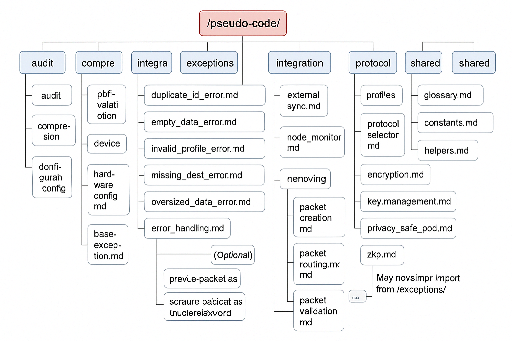

# MeshGuardian Pseudo-code Documentation

## Introduction

The `/pseudo-code/` directory contains pseudo-code files that serve as a roadmap for implementing the various modules and components of the MeshGuardian software. These files provide a high-level, language-agnostic description of the logic and structure, making it easier for developers to understand and implement the system across different programming languages.

**What is Pseudo-code?** Pseudo-code is a simplified, human-readable way to describe program logic without using language-specific syntax. It focuses on the intended behavior, allowing flexibility in implementation.

This directory is part of the broader MeshGuardian documentation. For more context, see the [main README](../README.md).

## Structure

The pseudo-code files are organized into subfolders based on functional areas:

### audit/
Logic for logging and auditing system activities:
- `audit_trail.md`

### compression/
Logic for compressing data to optimize storage and transmission:
- `compression.md`

### consensus/
Consensus algorithms and validation mechanisms for distributed systems:
- `pbft_validation.md`
- `pos_validation.md`
- `trust_graphs.md`

### device/
Hardware configuration and device management logic:
- `hardware_config.md`

### exceptions/
Shared error classes for consistent error handling across modules:
- `duplicate_id_error.md`
- `empty_data_error.md`
- `invalid_profile_error.md`
- `missing_dest_error.md`
- `missing_source_error.md`
- `oversized_data_error.md`
- `base_exception.md`

### integration/
Logic for syncing MeshGuardian with external systems:
- `external_sync.md`

### monitoring/
System monitoring and health check logic:
- `node_monitor.md`

### networking/
Network communication and packet-handling logic:
- `packet_creation.md`
- `packet_buffering.md`
- `packet_routing.md`
- `packet_sending.md`
- `packet_receiving.md`
- `packet_validation.md`
- `error_handling.md`

### protocol/
Definitions for communication protocols:
- `profiles.md`
- `protocol_selector.md`

### security/
Security-related logic, including encryption and privacy:
- `encryption.md`
- `key_management.md`
- `privacy_safe_pod.md`
- `zkp.md`

### shared/
Shared utilities, constants, and definitions:
- `glossary.md`
- `constants.md`
- `helpers.md`

## File Structure

Below is the hierarchical structure of the `/pseudo-code/` directory:


```
/pseudo-code/
├── audit/
│   └── audit_trail.md
├── compression/
│   └── compression.md
├── consensus/
│   ├── pbft_validation.md
│   ├── pos_validation.md
│   └── trust_graphs.md
├── device/
│   └── hardware_config.md
├── exceptions/
│   ├── duplicate_id_error.md
│   ├── empty_data_error.md
│   ├── invalid_profile_error.md
│   ├── missing_dest_error.md
│   ├── missing_source_error.md
│   ├── oversized_data_error.md
│   └── base_exception.md
├── integration/
│   └── external_sync.md
├── monitoring/
│   └── node_monitor.md
├── networking/
│   ├── packet_creation.md
│   ├── packet_buffering.md
│   ├── packet_routing.md
│   ├── packet_sending.md
│   ├── packet_receiving.md
│   ├── packet_validation.md
│   └── error_handling.md
├── protocol/
│   ├── profiles.md
│   └── protocol_selector.md
├── security/
│   ├── encryption.md
│   ├── key_management.md
│   ├── privacy_safe_pod.md
│   └── zkp.md
└── shared/
    ├── glossary.md
    ├── constants.md
    └── helpers.md
```


## Flowchart

The flowchart below visually represents the structure and relationships between the pseudo-code modules. It illustrates how key modules, such as `networking/` and `security/`, interact during operations like packet transmission:



## Usage

The pseudo-code files are intended to guide the implementation of the MeshGuardian software modules and components. Developers can refer to these files to understand the expected behavior and logic of each part of the system, ensuring consistency and correctness in the implementation. The pseudo-code is written in a language-agnostic format, making it adaptable to various programming languages.

**Example**: To implement packet routing, refer to `networking/packet_routing.md` for the high-level logic, then translate it into your chosen language (e.g., Python or C++).

For more details on specific modules, navigate to the respective subfolders and review the Markdown files within. To contribute to or update the pseudo-code, see the [contribution guide](../CONTRIBUTING.md).

## Getting Started

New to MeshGuardian? Start by exploring these files:
- `shared/glossary.md`: Understand key terms and concepts.
- `networking/packet_routing.md`: See a core networking example.
- `security/encryption.md`: Learn about security fundamentals.

## Last Updated

Jue 2025
