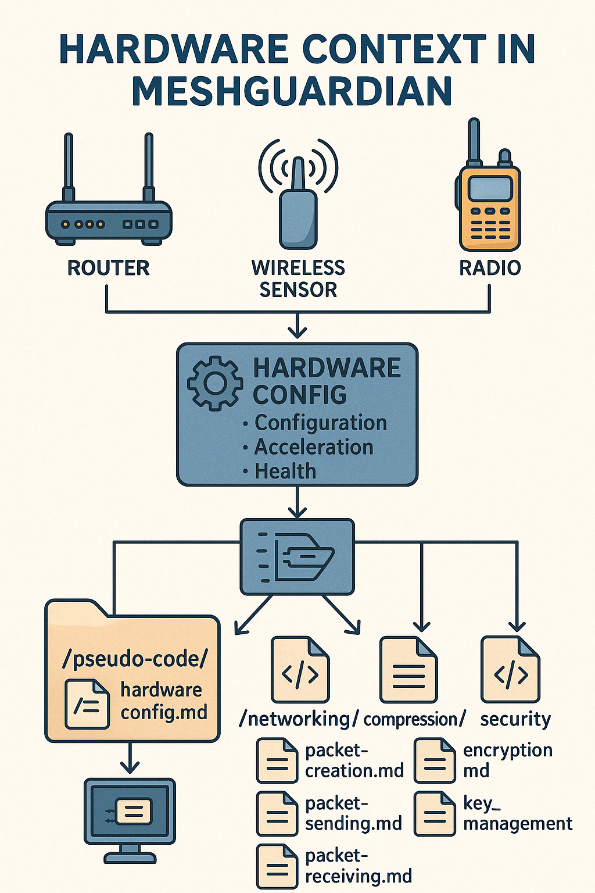

# Hardware Integration in MeshGuardian Protocol Stack

## Overview

This illustration provides a visual breakdown of how **hardware components** interact with and support the protocol logic within the [MeshGuardian](https://github.com/macleen/meshguardian) architecture. While the pseudo-code directory defines software logic across modules such as networking, security, and monitoring, this diagram highlights **where and how physical hardware comes into play**—especially in crisis and IoT environments.

## Key Layers

### Hardware Layer (Bottom)
- **Transceivers, NICs, Antennas:** Enable signal-level data transmission and reception across LoRa, Zigbee, or other mesh technologies.
- **Sensors & IoT Devices:** Source and destination nodes involved in sending or receiving data packets.
- **HSMs (Hardware Security Modules):** Used for secure key storage and cryptographic operations.

### Device Layer
- `/device/hardware_config.md`: Applies hardware settings like transmission power, frequency band, and antenna mode.
- Adjusts hardware to fit mission-critical needs (e.g., conserve energy, extend range).

### Monitoring Layer
- `/monitoring/node_monitor.md`: Continuously checks node health (CPU, battery, temp).
- Feeds data into protocol decisions—routes are adjusted if a node is degraded.

### Networking Layer
- `/networking/packet_creation.md`: Generates packets with TTL and priority tied to hardware constraints.
- `/networking/packet_sending.md` and `/packet_receiving.md`: Rely on hardware interfaces to physically send and receive data.
- `/networking/packet_routing.md`: Routes dynamically based on node status and hardware capacity.

### Security Layer
- `/security/encryption.md`, `/key_management.md`: Use HSMs for secure cryptographic operations.
- Ensures encryption and decryption rely on tamper-resistant hardware when available.

### Compression Layer
- `/compression/compression.md`: Supports hardware acceleration (e.g., using GPU) for efficient data compression.

## Use Cases

This architecture is especially relevant for:
- Intermittent or DTN environments (e.g., interplanetary mesh, disaster zones)
- Energy-constrained IoT networks
- Secure, resilient mesh communication in untrusted zones (e.g., Use Cases 5.15, 5.16)

## Summary

Hardware isn’t just a backdrop in MeshGuardian—it’s a **dynamic partner in protocol execution**. By integrating closely with configuration, monitoring, and security modules, MeshGuardian ensures protocols adapt to real-world constraints in the field.

---

## 📁 More info

- [hardware_config.md](hardware_config.md)
- [node_monitor.md](./../monitoring/node_monitor.md)
- [packet_creation.md](./../networking/packet_creation.md)